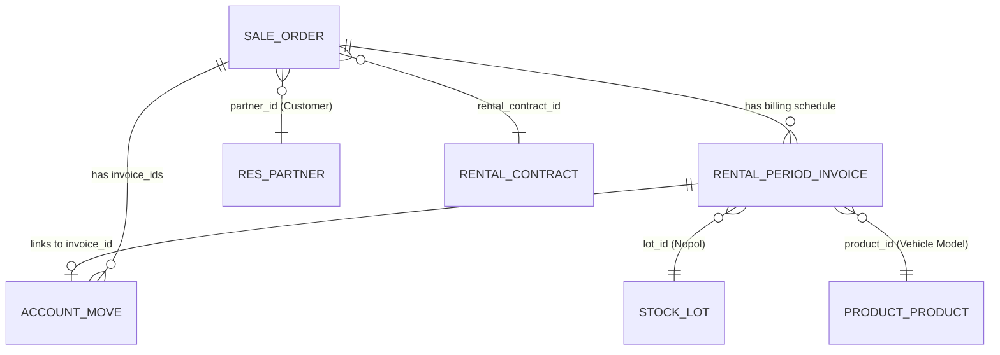

# Uninvoiced Accounting — Technical Architecture & Implementation Specification
**Project:** SDP Dashboard (`sdp_dashboard-main`)  
**Module:** Accounting Report → Uninvoiced Accounting  
**Reference Source:** Analyzed from `D:\project_sdp\odoo-finance-sdp-fork-main` (`UninvoicedRentalController.php`, `OdooService.php`, `invoice_logic_options.md`)  
**Date:** 2026-09-25  

---

## 1. Executive Summary & Objective

The **Uninvoiced Accounting** sub-menu is designed for the finance and accounting team to identify, monitor, and reconcile rental contracts that have active fleet vehicles on rent but have **not yet had valid sales invoices posted in Odoo**.

Unlike standard reporting which only looks at billed figures, Uninvoiced Accounting acts as a **revenue leakage watchdog** and **billing queue manager**. It guarantees that:
1. No active vehicle rental period passes without being billed.
2. Returned vehicles with unpaid tail periods are captured before files close.
3. Reversed or cancelled invoices with missing replacements are flagged.
4. Future scheduled billings are visible for financial forecasting.

---

## 2. Odoo Ground Truth: Data Models & Relationships

Through direct code analysis of the Odoo Finance system (`odoo-finance-sdp-fork-main`), the following models and fields define uninvoiced billing:



### Key Technical Fields:
| Odoo Model | Field Name | Description & Usage |
| :--- | :--- | :--- |
| `rental.period.invoice` | `rental_order_id` | Contract Sale Order ID (`R/2025/...` or `R/2026/...`) |
| `rental.period.invoice` | `invoice_id` | Many2one link to `account.move`. `false` if unbilled |
| `rental.period.invoice` | `start_rental_period_date` | Start of the billing period cycle |
| `rental.period.invoice` | `end_rental_period_date` | End of the billing period cycle |
| `rental.period.invoice` | `invoice_date` | Target / scheduled invoice creation date |
| `rental.period.invoice` | `price_unit` | Scheduled billing amount for this specific period |
| `rental.period.invoice` | `rental_qty` / `rental_uom` | Rental quantity and unit of measure (`month`, `day`) |
| `rental.period.invoice` | `lot_id` | Vehicle license plate / lot reference (`B1898HOY`) |
| `rental.period.invoice` | `product_id` | Vehicle product model description |
| `account.move` | `state` | Invoice state: `draft`, `posted`, `cancel` |
| `account.move` | `payment_state` | `not_paid`, `paid`, `in_payment`, `reversed` |
| `account.move` | `move_type` | `out_invoice` (Customer Invoice), `out_refund` (Credit Note) |
| `sale.order` | `rental_status` | Status: `reserved`, `pickedup`, `returned`, `cancel` |
| `sale.order` | `actual_start_rental` | Physical vehicle handover date |
| `sale.order` | `actual_end_rental` | Physical vehicle return date |
| `sale.order` | `sale_invoice_period_id` | Billing frequency (Monthly, Quarterly, Yearly) |
| `stock.lot` | `name` / `ref` / `vehicle_year` | Nopol, Chassis number, and Manufacture year |
| `res.partner` | `ref` / `name` / `vat` / `tku_number` | Customer code, full company name, NPWP, TKU |

---

## 3. Core Business Logic & "Weird Conditions" (From Odoo-Finance)

An invoice is **not** simply defined by `invoice_id = false`. The Odoo Finance system discovered three critical real-world conditions that must be handled:

### Condition 1: Direct Uninvoiced Period (`invoice_id = false`)
* The standard case where a contract period has been generated, has a price (`price_unit > 0`), but no invoice was ever triggered in Odoo.
* **Filter:** `['invoice_id', '=', false], ['price_unit', '>', 0]`

### Condition 2: Draft / Unposted Invoices (`state = 'draft'`)
* A billing officer generated an invoice in Odoo, but it remains in **Draft** state.
* **Why it matters:** Draft invoices do not affect general ledger accounts, cannot be sent to customers, and have not legally occurred.
* **Filter:** `['invoice_id.state', '=', 'draft'], ['price_unit', '>', 0]`

### Condition 3: Reversed / Credit-Noted Invoices (`payment_state = 'reversed'`)
* An invoice was posted in the past, but was subsequently cancelled or reversed via a Credit Note (`out_refund`).
* If the contract vehicle is still active (`rental_status != 'returned'`), the customer has not paid for that period and a replacement invoice is required.
* **Filter:** `['invoice_id.payment_state', '=', 'reversed'], ['rental_order_id.rental_status', '!=', 'returned']`

### The "Replacement Invoice" Edge Case (Crucial)
* When an invoice is reversed, finance often creates a manual replacement invoice directly under the Sale Order (`sale.order.invoice_ids`) without linking it back to the `rental.period.invoice` record.
* **How to avoid false positives:**
  ```php
  // If invoice is reversed, inspect all sale.order invoice_ids:
  foreach ($soInvoices as $soInv) {
      if ($soInv['move_type'] === 'out_invoice' && $soInv['state'] === 'posted') {
          if ($soInv['invoice_date'] >= $originalInvoiceDate) {
              $hasReplacement = true;
              break; // Skip: already re-billed!
          }
      }
  }
  ```

### The "Earliest Unbilled Period" Rule (`tanggal_periode_belum_cetak`)
* Contracts span 12 to 36 months. If Month 1–3 were invoiced, Months 4–36 are all technically uninvoiced.
* Rather than flooding reports with 30 future lines for a single car, the system groups by contract and identifies the **Earliest Unbilled Period**:
  $$\text{tanggal\_periode\_belum\_cetak} = \min(\text{start\_rental\_period\_date})$$
* This isolates the **exact bottleneck month** where the customer's billing stopped.

### The "Returned (Unbilled)" Catch
* If a vehicle returned from rent (`rental_status = 'returned'`), but its final period is unbilled, it is specifically classified as **`Returned (Unbilled)`**.
* This prevents finance from archiving contracts before capturing final prorated invoices.

---

## 4. Integration with SDP Dashboard

The implementation in `sdp_dashboard-main` builds upon this logic while integrating with our existing UI and architecture:

### A. Date Range & Fiscal Year Filtering
* Uses the newly added **Month & Year Picker** (`From: YYYY-MM` to `To: YYYY-MM` + `Year: YYYY`).
* Filters uninvoiced periods where the unbilled period date (`tanggal_periode_belum_cetak` or `start_rental_period_date`) falls within the selected date range.

### B. High-Performance Caching & Sync Architecture
* Rather than querying Odoo live on every page load (which times out on thousands of records), uses a 2-tier cache pattern matching `Summary Rented Vehicle`:
  1. **Cached Data**: Stored in `Cache::remember("accounting_uninvoiced_{$year}", 86400, ...)`
  2. **Fast Incremental Sync**: Checks `write_date >= now - 7 days` to refresh modified orders in 1–2 seconds.
  3. **Full Batch Sync**: Fetches in chunks of 500 records via XML-RPC.

### C. Granular User Permissions
* **Accounting Report** parent access: `can_view_accounting_report`
* **Uninvoiced Accounting** child access: `can_view_uninvoiced_accounting`
* Controlled in User Management (`/settings/users`) with automatic IT Admin nationwide bypass.

---

## 5. Recommended UI Presentation

To give finance both executive visibility and operational utility, the page will offer:

```
+---------------------------------------------------------------------------------------------------+
|  Accounting Report / Uninvoiced Accounting                                       [ Year: 2026 v ] |
|                                                                                                   |
|  [ Search Customer/Nopol... ]  [ From: Apr 2026 v ] -> [ To: Sep 2026 v ]  [ Apply ]  [ Fast Sync ]|
+---------------------------------------------------------------------------------------------------+
|  [ Rp 1,420,500,000 ]         [ 142 Units ]             [ 28 Overdue ]        [ 18 Returned Unbilled ]
|   Total Unbilled Value         Total Pending Units       Requires Immediate     Units Returned but   
|                                                          Invoice Generation     Not Final-Billed      
+---------------------------------------------------------------------------------------------------+
|  TABS:  [ (1) Customer Monthly Pivot ]    [ (2) Detailed Line-Item Audit List ]    [ Export Excel ]
+---------------------------------------------------------------------------------------------------+
```

### View 1: Customer Monthly Pivot (Executive Overview)
* Grouped by **Customer**, collapsible by **Nopol / Vehicle**.
* Columns across selected months (Apr, May, Jun, Jul, Aug, Sep).
* Cells show: **Units Uninvoiced** and **Rp Amount**.

### View 2: Detailed Line-Item Audit Table (Operational Finance List)
* Full 30-column operational table including:
  * Customer Code & Name (`Kode Cust`, `Nama User`)
  * Contract & SO Reference (`Nomor SO`, `Nomor PO`, `Nomor Kontrak`)
  * Vehicle Details (`Nopol`, `Model`, `Tahun`, `Chassis`, `Area Pemakaian`)
  * Billing Dates (`Start Period`, `End Period`, `Tanggal Periode Belum Cetak`)
  * Rate Comparison (`Price di SO` vs `Duration Price`)
  * Tax & Billing PIC (`Tax ID / NPWP`, `ID TKU`, `Kode Transaksi`, `Invoice PIC`, `Bank`)

---

## 6. Implementation Action Plan

- [x] **Step 1: Database Migration & Model Setup**
  * Added `can_view_uninvoiced_accounting` column to `users` table.
  * Updated `User.php` fillable, casts, and permission helpers.
- [x] **Step 2: User Settings & Sidebar UI**
  * Added permission checkbox in `/settings/users`.
  * Added sub-menu link in `/resources/views/layouts/app.blade.php`.
  * Created base view with Month/Year pickers in `/resources/views/accounting/uninvoiced.blade.php`.
- [ ] **Step 3: Odoo Service Engine (`OdooService.php`)**
  * Implement `fetchUninvoicedAccountingData(int $year, ...)` with:
    - Condition 1: `invoice_id = false`
    - Condition 2: `invoice_id.state = 'draft'`
    - Condition 3: `invoice_id.payment_state = 'reversed'`
    - Replacement invoice cross-check on `sale.order.invoice_ids`
    - Earliest unbilled period determination (`tanggal_periode_belum_cetak`)
- [ ] **Step 4: Controller & Aggregation (`AccountingController.php`)**
  * Filter by selected `start_month` to `end_month`.
  * Compute summary KPI totals (Total Amount, Total Units, Overdue vs Scheduled).
  * Format pivot dataset and detailed list dataset.
- [ ] **Step 5: View Rendering & Excel/CSV Export**
  * Implement Pivot View & Detailed View with tab switcher.
  * Add Excel & CSV export matching finance standard.
