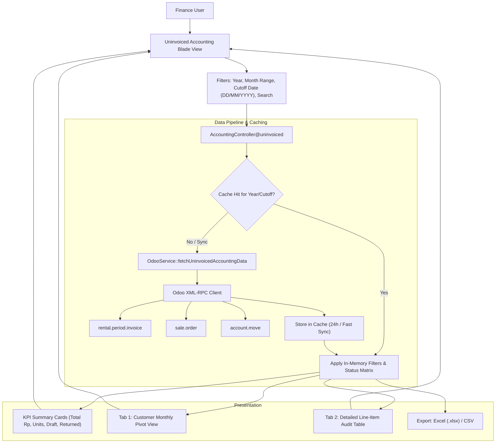

# Uninvoiced Accounting — Comprehensive Implementation Plan

**Project:** SDP Dashboard (`sdp_dashboard-main`)  
**Target Module:** Accounting Report → Uninvoiced Accounting  
**Route:** `/accounting/uninvoiced` (`accounting.uninvoiced`)  
**Specification Reference:** `UNINVOICED_ACCOUNTING_ARCHITECTURE.md`  
**Date:** 2026-09-25  
**Status:** Approved for Implementation  

---

## 0. STRICT ISOLATION & NON-INTERFERENCE ARCHITECTURE (ZERO IMPACT GUARANTEE)

> [!IMPORTANT]
> **IRON-CLAD NON-INTERFERENCE PRINCIPLE:**  
> The newly added **Uninvoiced Accounting** module operates in complete logical, physical, and cache isolation from all existing modules. It **MUST NOT** and **WILL NOT** affect, modify, overwrite, or interfere with:
> 1. **Accounting Report → Summary Rented Vehicle** (`/accounting/summary-rented-vehicle`)
> 2. Existing Odoo synchronizations (Summary Rented Vehicle sync, Inventory sync, etc.)
> 3. Other modules (CRM, LoR, Surat Kuasa, Disposal, Stock Dashboard)
> 4. The external project `D:\project_sdp\odoo-finance-sdp-fork-main` (strictly read-only reference)

### Strict Technical Isolation Checklist:

| Component | Existing `Summary Rented Vehicle` | New `Uninvoiced Accounting` | Collision Prevention Guarantee |
| :--- | :--- | :--- | :--- |
| **Cache Key (Data)** | `accounting_subscription_master_{year}` | `uninvoiced_accounting_data_{year}_{cutoff}` | **100% Isolated.** Different namespaces; neither can overwrite the other. |
| **Cache Key (Sync Progress)** | `accounting_sync_progress_{year}` | `uninvoiced_sync_progress_{year}` | **100% Isolated.** Progress bars and lock states never collide. |
| **Cache Key (Timestamp)** | `accounting_last_synced_{year}` | `uninvoiced_last_synced_{year}` | **100% Isolated.** Sync timestamps are independent. |
| **OdooService Method** | `fetchAccountingSubscriptionMaster()` | `fetchUninvoicedAccountingData()` | **100% Isolated.** Dedicated method; zero edits to `fetchAccountingSubscriptionMaster()`. |
| **HTTP Routes** | `/accounting/summary-rented-vehicle/*` | `/accounting/uninvoiced/*` | **100% Isolated.** Distinct endpoints and controllers. |
| **Controller Actions** | `AccountingController@summaryRentedVehicle` | `AccountingController@uninvoiced` | **100% Isolated.** Independent methods, requests, and outputs. |
| **Permissions** | `can_view_summary_rented_vehicle` | `can_view_uninvoiced_accounting` | **100% Isolated.** Granular independent toggles in User Management. |
| **Blade Views** | `accounting/summary_rented_vehicle.blade.php`| `accounting/uninvoiced.blade.php` | **100% Isolated.** Dedicated Blade templates and Alpine components. |

---

## 1. Executive Summary & Objective

The **Uninvoiced Accounting** module provides the Finance & Accounting leadership with a **Point-in-Time (As-Of Cutoff)** audit tool to track rental contracts and active fleet vehicles that have not yet had valid, posted invoices in Odoo as of a chosen cutoff date.

### Core Distinctions from Standard Billing Reports:
1. **Historical Backdate Audit (As-Of Date):** If a user selects September 2026 with Cutoff `01/09/2026` (or `30/09/2026`), any invoice that was dated or printed in October (e.g., `01/10/2026`) **must be reported as UNINVOICED**, because as of that cutoff date in the past, it had not been billed yet.
2. **Draft Invoice Watchdog:** Any invoice that was generated in Odoo but remains in `draft` state as of the Cutoff date is flagged as **DRAFT (Unposted)**, alerting finance to finalize approvals.
3. **Reversed Invoices & Credit Notes:** Detects vehicles still active whose previous invoices were reversed without an active replacement invoice.
4. **Returned (Unbilled) Tail Capture:** Flags vehicles physically returned whose final prorated billing period was never invoiced.

---

## 2. Business Rules & Point-in-Time Cutoff Truth Table

### 2.1 The Cutoff Rule
* The user selects a **Month Range** (`From: YYYY-MM` to `To: YYYY-MM`, within a Fiscal Year `YYYY`).
* The user selects a **Cutoff Date** (`DD/MM/YYYY`, selectable date, no hours required).
  * *Default behavior:* Automatically initializes to the end of the selected "To" Month (e.g., selecting Sep 2026 defaults Cutoff to `30/09/2026`), but the user can click to pick any specific date (e.g., `01/09/2026` or `24/09/2026`).

### 2.2 Point-in-Time Classification Matrix

For every rental billing period cycle in Odoo (`rental.period.invoice`) where:
$$\text{start\_rental\_period\_date} \le \text{Cutoff Date} \quad \text{AND} \quad \text{price\_unit} > 0$$

The billing status **as of the Cutoff Date** is determined by the following matrix:

| Scenario | Invoice Status in Odoo | Invoice Date vs Cutoff Date | Status as of Cutoff | Action / Impact |
| :--- | :--- | :--- | :--- | :--- |
| **A. Pure Uninvoiced** | `invoice_id = false` | N/A | UNINVOICED (Belum Ada Invoice) | Revenue not yet billed. Needs invoice creation. |
| **B. Invoiced Post-Cutoff** *(User Example)* | `invoice_id` posted today | `invoice_date > Cutoff Date` (e.g., Inv Date `01/10/26` vs Cutoff `01/09/26`) | UNINVOICED AS OF CUTOFF *(Invoiced Later)* | Valid backdate audit. Was unbilled at cutoff. |
| **C. Draft Invoice** | `invoice_id.state = 'draft'` | `invoice_date <= Cutoff Date` | DRAFT (Belum Posted) | Draft exists in Odoo, but unposted to General Ledger. |
| **D. Reversed / Cancelled** | `payment_state = 'reversed'` or `state = 'cancel'` | `invoice_date <= Cutoff Date` | REVERSED (Perlu Cetak Ulang) | Invoice was cancelled/credited; replacement missing. |
| **E. Legitimately Invoiced** | `invoice_id.state = 'posted'` | `invoice_date <= Cutoff Date` | **INVOICED (Exclude)** | Billed legally on or before Cutoff. Excluded from report. |

---

## 3. Architecture & Data Flow

### 3.1 Technical Fields Required from Odoo:
1. `rental.period.invoice`: `id`, `rental_order_id`, `invoice_id`, `invoice_date`, `start_rental_period_date`, `end_rental_period_date`, `price_unit`, `rental_qty`, `rental_uom`, `lot_id`, `product_id`, `area_id`.
2. `sale.order`: `id`, `name`, `partner_id`, `client_order_ref`, `rental_contract_id`, `actual_start_rental`, `actual_end_rental`, `rental_status`, `invoice_ids`.
3. `account.move`: `id`, `name`, `move_type`, `state`, `payment_state`, `invoice_date`, `create_date`.
4. `res.partner`: `id`, `name`, `ref`, `vat`, `tku_number`.
5. `stock.lot`: `id`, `name` (Nopol), `vehicle_year`, `ref` (Chassis).

---

### 3.2 Detailed Line-Item Audit Table Specification (The 16 Columns)

> [!NOTE]
> **Financial Definition of Nilai Sewa (IDR):**  
> In Odoo's `rental.period.invoice`, `price_unit` represents the **agreed scheduled Invoice Price (DPP / Untaxed Amount)** for that specific billing cycle period. If the rental period is standard 1 month (`rental_qty = 1`), `price_unit` is the exact monthly invoice price. If the vehicle had a partial/prorated month (e.g. returned early), `price_unit * rental_qty` is the exact prorated invoice amount that will appear on the customer invoice.

The operational audit table and Excel export will contain these exact **17 columns**:

| Col # | Column Name | Odoo Source Model & Field | Description / Business Meaning |
| :---: | :--- | :--- | :--- |
| **1** | **No.** | Auto-increment index | Row sequence number |
| **2** | **Kode Cust** | `res.partner.ref` | Customer unique reference code |
| **3** | **Nama Customer** | `res.partner.name` | Full legal/company customer name |
| **4** | **Nomor SO** | `sale.order.name` | Sales Order contract reference (`R/2026/...`) |
| **5** | **Nomor PO / Kontrak**| `sale.order.client_order_ref` | Customer Purchase Order or master contract ref |
| **6** | **Nopol** | `stock.lot.name` | Vehicle license plate number (`B 1898 HOY`) |
| **7** | **No. Rangka (Chassis)** | `stock.lot.ref` | Vehicle Chassis number / VIN |
| **8** | **Model Kendaraan** | `product.product.name` | Vehicle model (e.g. *Innova Zenix 2.0 G CVT*) |
| **9** | **Tahun Mobil** | `stock.lot.vehicle_year` | Vehicle year of manufacture |
| **10** | **Start Period** | `rental.period.invoice.start_rental_period_date` | Start date of this unbilled rental cycle (`DD/MM/YYYY`) |
| **11** | **End Period** | `rental.period.invoice.end_rental_period_date` | End date of this unbilled rental cycle (`DD/MM/YYYY`) |
| **12** | **Status per Cutoff** | *Point-in-Time Evaluation* | Color-coded status badge: • **Belum Ada Invoice** (Red) • **Dicetak Pasca-Cutoff** (Blue - e.g. Inv 01/10/26) • **Draft Belum Posted** (Amber) • **Reversed (Perlu Cetak Ulang)** (Purple) |
| **13** | **Nomor Invoice Odoo** | `account.move.name` | Blank if unbilled, or shows invoice # if drafted/printed later |
| **14** | **Tanggal Invoice Odoo**| `account.move.invoice_date` | The actual invoice date recorded in Odoo (`DD/MM/YYYY`) |
| **15** | **Nilai Sewa (IDR)** | `rental.period.invoice.price_unit` | Scheduled invoice price for that period (before tax) |
| **16** | **Rental Status** | `sale.order.rental_status` | Status: `Picked Up` (Active on rent) or `Returned` |
| **17** | **Area Pemakaian** | `rental.period.invoice.area_id` | Branch / vehicle operating area |

---

## 4. Phased Implementation Roadmap

### Phase 1: Database Migration & User Permissions (COMPLETED)
- [x] Column `can_view_uninvoiced_accounting` added to `users` table via migration.
- [x] Permission helper methods added to `User.php` (`canViewUninvoicedAccounting()`).
- [x] User Management settings UI updated in `resources/views/settings/users.blade.php`.
- [x] Navigation route `/accounting/uninvoiced` registered with permission middleware.

---

### Phase 2: UI Filter Bar & Cutoff Date Picker
- [ ] Add the **Cutoff Date Picker** (`DD/MM/YYYY`, calendar popover, no hours) into `resources/views/accounting/uninvoiced.blade.php`.
- [ ] Integrate reactive Alpine.js state:
  - When the user selects or changes `start_month` or `end_month`, update the default Cutoff Date to the end of `end_month`.
  - Allow manual override so user can pick any backdated cutoff date (e.g. `01/09/2026` or `24/09/2026`).
- [ ] Add Status Filter selector: `All Status`, `Uninvoiced Only`, `Draft Only`, `Reversed Only`, `Returned Unbilled Only`.
- [ ] Add Fast Sync button with loading spinner.

---

### Phase 3: Backend Odoo Service Engine (`OdooService.php`)
- [ ] Implement isolated method `fetchUninvoicedAccountingData(int $year, string $cutoffDate, bool $forceRefresh = false)`:
  - **100% Zero-Touch Rule:** Do NOT edit, touch, or call `fetchAccountingSubscriptionMaster()` or any existing method in `OdooService.php`.
  - Query `rental.period.invoice` records where `start_rental_period_date <= $cutoffDate` and `price_unit > 0`.
  - Batch fetch linked `sale.order` and `account.move` records using 500-item chunking.
  - Apply the Point-in-Time truth table (Scenario A, B, C, D, E).
  - Cache results under isolated key `uninvoiced_accounting_data_{year}_{cutoffDate}` with high-speed incremental refresh (`write_date >= 7 days`).
  - Strict isolation: zero impact on `Summary Rented Vehicle` or any other module.

---

### Phase 4: Controller & Aggregation Pipeline (`AccountingController.php`)
- [ ] Build isolated controller actions in `AccountingController.php`:
  - `uninvoiced(Request $request)`: Main page view and data aggregator.
  - `triggerUninvoicedSync(Request $request)`: Trigger sync using dedicated cache key `uninvoiced_sync_progress_{year}` (completely separate from `accounting_sync_progress_{year}`).
  - `getUninvoicedSyncProgress(Request $request)`: Poll progress for Uninvoiced sync modal without touching Summary Rented Vehicle sync state.
  - Read query parameters (`year`, `start_month`, `end_month`, `cutoff_date`, `search`, `status`).
  - Calculate Executive KPIs:
    - **Total Unbilled Value (Rp)**
    - **Total Pending Units** (Distinct vehicle count)
    - **Draft Pending Value & Units**
    - **Returned Unbilled Units**
  - Group and structure datasets for:
    - **Dataset A (Monthly Pivot):** Grouped by Customer $\rightarrow$ Vehicle, with columns for each month in range.
    - **Dataset B (Detailed List):** Flat array of period items for full operational table.

---

### Phase 5: View Rendering (KPI Cards, Pivot Tab & Detailed Audit Table)
- [ ] Implement **Executive Summary KPI Cards** in `resources/views/accounting/uninvoiced.blade.php`.
- [ ] Implement **Tab 1: Customer Monthly Pivot**:
  - Interactive collapsible rows (Customer $\rightarrow$ Units).
  - Monthly columns showing (Unit count, Rp value).
  - Grand total footer row.
- [ ] Implement **Tab 2: Detailed Line-Item Audit Table**:
  - Full operational table with all **17 columns** defined in Section 3.2:
    `No.`, `Kode Cust`, `Nama Customer`, `Nomor SO`, `Nomor PO / Kontrak`, `Nopol`, `No. Rangka (Chassis)`, `Model Kendaraan`, `Tahun Mobil`, `Start Period`, `End Period`, `Status per Cutoff`, `Nomor Invoice Odoo`, `Tanggal Invoice Odoo`, `Nilai Sewa (IDR)`, `Rental Status`, `Area Pemakaian`.
  - Color-coded badges for **Status per Cutoff**:
    - Red badge: `Belum Ada Invoice`
    - Blue badge: `Dicetak Pasca-Cutoff (e.g. Inv 01/10/26)`
    - Amber badge: `Draft Belum Posted`
    - Purple badge: `Reversed (Perlu Cetak Ulang)`

---

### Phase 6: Excel / CSV Export & Live Verification
- [ ] Implement `AccountingController@exportUninvoiced`:
  - Export filtered dataset to CSV / Excel matching the exact **17 columns** from Section 3.2.
- [ ] Run live end-to-end verification against local `php artisan serve` and verify with sample contract scenarios (including Customer A backdate case).
- [ ] Verify zero regressions on `Summary Rented Vehicle`, `LoR`, `CRM`, `Surat Kuasa`, `Disposal`, `Stock`.

---

## 5. Risk Assessment & Mitigations

| Risk | Mitigation |
| :--- | :--- |
| **Odoo Query Timeout on Large Dataset** | Use chunked 500-record batching and cache intermediate results. Avoid live N+1 queries. |
| **Backdate Logic Discrepancy** | Strictly evaluate `invoice_date <= Cutoff Date` AND `state == 'posted'`. Invoices dated after cutoff are treated as uninvoiced. |
| **Regression on Existing Menus** | New functions are strictly self-contained in `AccountingController@uninvoiced` and new methods in `OdooService`. Existing methods are untouched. |
