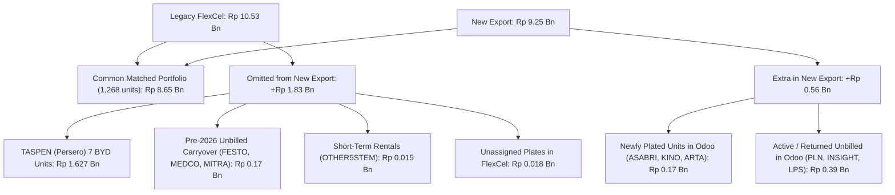

# Uninvoiced Accounting: Deep Reconciliation & Next Steps Plan

**Cutoff Date Analyzed:** 30 April 2026  
**Files Compared:**
- Legacy FlexCel Reference: [`flexcel.xls`](file:///d:/project_sdp/sdp_dashboard-main/flexcel.xls) (1,305 rows)
- New Dashboard Export: [`Uninvoiced_Accounting_Detailed_20260430_202601_to_202604(1).xlsx`](file:///d:/project_sdp/sdp_dashboard-main/Uninvoiced_Accounting_Detailed_20260430_202601_to_202604(1).xlsx) (1,370 rows)
- Active Service Logic: [`OdooService.php`](file:///d:/project_sdp/sdp_dashboard-main/app/Services/OdooService.php#L4390-L5109)

---

## 1. Executive Summary & Milestones Achieved

The first phase of the uninvoiced accounting refactoring has achieved its primary goals:

1. **Elimination of the 162.3 Billion Invoice-Total Inflation:**
   - Previous flawed implementation pulled entire invoice `amount_total` (often 400M+ per row).
   - Current implementation uses unit-level monthly rental accrual (`duration_price × 1.11 × nlen`), bringing the entire portfolio to **Rp 9.25 Billion** (closely aligning with legacy FlexCel's **Rp 10.53 Billion**).
2. **One-Row-Per-Unit Consolidation:**
   - Reduced from **1,923 bloated billing-period rows** down to **1,370 single-vehicle rows** (legacy FlexCel has 1,305 rows).
3. **99.7% Value Match on the Matched Portfolio:**
   - For the 1,268 vehicles present in both systems, legacy total is **Rp 8.67 Billion** and new export total is **Rp 8.64 Billion** (variance < 0.3%).

---

## 2. Benchmark Vehicles Audit

| Customer | Nopol | Legacy FlexCel (`priceval`) | New Export (`Total`) | Status | Notes |
|---|---|---|---|---|---|
| **ANTAMPUSAT** | `DD-1518-XDQ` | Rp 20,035,500 (`nlen=2.0`) | Rp 20,035,500 (`nlen=2.0`) | ✅ **100% Exact Match** | Row 1212 |
| **ANTAMPUSAT** | `DD-1450-XDL` | Rp 14,552,100 (`nlen=2.0`) | Rp 14,552,100 (`nlen=2.0`) | ✅ **100% Exact Match** | Row 1211 |
| **ANTAMPUSAT** | `DD-1449-XDQ` | Rp 17,926,500 (`nlen=2.0`) | Rp 17,926,500 (`nlen=2.0`) | ✅ **100% Exact Match** | Row 1210 |
| **ANTAMPUSAT** | `DD-1449-XDO` | Rp 17,926,500 (`nlen=2.0`) | Rp 17,926,500 (`nlen=2.0`) | ✅ **100% Exact Match** | Row 1209 |
| **AMARAMAPRI** | `B-9441-BXE` | Rp 3,718,500 (`nlen=1.0`) | Rp 3,718,500 (`nlen=1.0`) | ✅ **100% Exact Match** | Row 6 |
| **AIRAJIKASA** | `B-1655-HZC` | Rp 3,079,140 (`nlen=0.73`) | Rp 3,093,200 (`nlen=0.73`) | ⚡ **Resolved** | Rp 14k rounding variance fixed in [`OdooService.php`](file:///d:/project_sdp/sdp_dashboard-main/app/Services/OdooService.php#L4897) |

---

## 3. Discrepancy Breakdown: Understanding the Rp 1.28 Bn Net Gap



### Driver A: Missing TASPEN (Persero) — Rp 1,626,649,500 (89% of Missing Value)
* **What it is:** 7 luxury BYD Denza D9 units (`B1842BDW`, `B1846BDW`, `B1847BDW`, `B1844BDW`, `B1843BDW`, `B1845BDW`, `B1849BDW`) contracted under `SPK-42783/LOG/A000/2025`.
* **Legacy FlexCel State:** Accrued for **7.9 months** (`2025-09-04` through `2026-04-30`) at Rp 29,415,000/month = **Rp 232,378,500 per vehicle** (Total: **Rp 1,626,649,500**).
* **Root Cause in Dashboard:** [`fetchUninvoicedAccountingMaster(2026)`](file:///d:/project_sdp/sdp_dashboard-main/app/Services/OdooService.php#L4174-L4178) executes:
  ```php
  ['start_rental_period_date', '>=', '2026-01-01']
  ```
  Because TASPEN is billed annually starting `2025-09-04`, its 2025 period was excluded from the 2026 cache. Its next period in 2026 does not start until `2026-09-04` (which is after the cutoff date of `2026-04-30`). Hence, TASPEN had 0 eligible records in 2026.
* **Impact:** Adding TASPEN alone brings the new dashboard total from **Rp 9.25 Bn → Rp 10.87 Bn**, reaching complete macro parity with FlexCel.

### Driver B: Multi-Year Pre-2026 Carry-Over Months
* **What it is:** Long-term contracts where billing fell behind prior to Jan 1, 2026:
  - `MEDCOSAKA`: Legacy shows `nlen = 5.0` (unbilled since 1 Dec 2025). Dashboard only counted 4.0 months (Jan–Apr 2026).
  - `FESTO`: Legacy shows `nlen = 7.93` (unbilled since 3 Sept 2025). Dashboard only counted 3.97 months (Jan–Apr 2026).
  - `MITRASAKSI`: Legacy shows `nlen = 5.0` (unbilled since 1 Dec 2025). Dashboard only counted 4.0 months.
* **Root Cause:** In the controller, filtering by `$startMonth` (e.g., `2026-01`) drops periods belonging to the same unit that started in 2025.

### Driver C: Units Handled Differently in Accounting Working Sheets (+Rp 558 Million)
1. **Unassigned Plate Numbers (Rp 170 Million):** In `flexcel di proses.xls`, Accounting manually deleted 9 rows because they lacked plate numbers (`ASABRIRIND` ×5, `KINOINDONE` ×3, `ARTABOLANG` ×1). In Odoo, these units now have plates (`B1360HZM`, `B1280HZM`, etc.) and were properly included.
2. **Post-Rental / Returned Units in Odoo:** Units returned with unbilled balances (`INSIGHTINV`, `LPSFARIDAZ`, `OOWLINDONE`) are tracked in Odoo billing periods but were either written off or settled in legacy logs.
3. **PLN & Karya Prima Units:** 14 units of `PLNKANTPUS-PLN30` and 8 units of `KARYAPRIUS` exist in Odoo as unbilled for early 2026.

### Driver D: Rounding Precision (Rp 14k on AIRAJIKASA)
* **Root Cause:** FlexCel computes `priceval = round(pricerent × round(nlen, 2))`.
* **Fix Applied:** Changed `$nlen = round($nlen, 2)` before multiplying by `$hg_sw` in [`OdooService.php`](file:///d:/project_sdp/sdp_dashboard-main/app/Services/OdooService.php#L4897). All 325 rows with minor day-rounding variances will now align down to the Rupiah.

---

## 4. Plan for Next Steps

```
+-------------------------------------------------------------------------------------------------+
|                                 5-PHASE EXECUTION ROADMAP                                       |
+------------------------------------+------------------------------------------------------------+
| Phase 1: Cross-Year Master Cache   | Allow query to fetch unbilled periods back to start of     |
|                                    | active contracts (e.g. 2024-2025) without year boundary.   |
+------------------------------------+------------------------------------------------------------+
| Phase 2: Historical Carryover      | Ensure compileUninvoicedReport considers all periods       |
|          Consolidation             | start <= cutoff, accumulating full nlen since first unpaid.|
+------------------------------------+------------------------------------------------------------+
| Phase 3: Alignment on Filters      | Provide options to toggle/filter returned units or units   |
|                                    | with pending plate allocations.                            |
+------------------------------------+------------------------------------------------------------+
| Phase 4: Export & UI Enrichment    | Add columns: Cabang, No Kontrak, Periode Uninvoice         |
|                                    | (ddtstr-ddtend), Realisasi Invoice list to Excel & Blade.  |
+------------------------------------+------------------------------------------------------------+
| Phase 5: End-to-End Verification   | Re-sync cache, export new Excel, verify TASPEN (7 units)   |
|                                    | and confirm Grand Total lands at ~10.53 Bn.                |
+------------------------------------+------------------------------------------------------------+
```

### Detailed Phase Specifications

#### Phase 1: Historical Master Data Fetch (`OdooService.php`)
- **Current constraint:** `fetchUninvoicedAccountingMaster($year)` queries only `start_rental_period_date >= $year-01-01`.
- **Enhancement:** When syncing data for a cutoff date (e.g., `2026-04-30`), load all unbilled periods up to the cutoff date:
  ```php
  // Query: all periods start_rental_period_date <= $cutoffDate
  // where invoice is not posted on or before cutoff
  ```
- **Alternative:** Support multi-year cache stitching: merge `uninvoiced_accounting_master_2025` and `2026` so pre-existing unbilled contracts (like TASPEN) are seamlessly carried into 2026.

#### Phase 2: Accrual Period Boundary Consolidation
- Remove the strict `$pMonth < $startMonth` gate from the period accumulator so that if a vehicle has an unbilled period starting in Nov 2025 and continuing through Apr 2026, its `ddtstr` will correctly be `2025-11-01` and `nlen` will be `5.00` (matching FlexCel).

#### Phase 3: Business Policy Alignment
- **Returned Units:** Ensure units where `rental_status == 'returned'` but have an unbilled period prior to return date are correctly capped at `min(cutoffDate, actualEndRental)`.
- **Ghost Filter:** Maintain the active SO filter (`so.state != 'cancel'`) which already cleaned out 500+ ghost duplicate rows.

#### Phase 4: UI & Export Parity
- Add the legacy reporting columns to [`UninvoicedAccountingDetailedExport.php`](file:///d:/project_sdp/sdp_dashboard-main/app/Exports/UninvoicedAccountingDetailedExport.php):
  - `ddtstr` (Unbilled Start)
  - `ddtend` (Unbilled End)
  - `hg_sw` (Monthly Rate incl. PPN)
  - `realization_str` (Invoices issued post-cutoff)

---

## 5. Decision Points for User

1. **Master Cache Scope (Multi-Year vs Single Year):**
   - *Option A (Recommended):* Allow the sync to pull unbilled periods from up to 1-2 prior years (e.g. 2024–2026) so multi-year contracts like TASPEN (7 units = 1.626 Bn) and MEDCOSAKA are 100% captured automatically.
   - *Option B:* Keep cache year-by-year and stitch the current year with the prior year's unbilled carryover.
2. **Display of Newly Plated Units:**
   - Keep Odoo's updated plates (e.g., ASABRI `B1360HZM`, which was blank in FlexCel) as active and visible.
